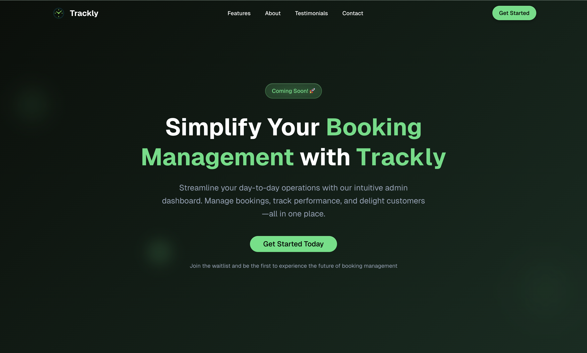

# Trackly - Booking Management Landing Page

Trackly is an intuitive booking management platform designed to simplify day-to-day operations for administrators. This repository contains the modern landing page built with Next.js 15, showcasing Trackly's features and capabilities.



## What is Trackly?

Trackly transforms how businesses manage reservations and bookings through its powerful admin dashboard. Our platform offers:

### 🚀 Key Features

- **Effortless Booking Management** - Create, edit, and track all bookings in one centralized location
- **Real-time Analytics** - Monitor booking trends and performance metrics with live dashboards
- **Customer Communication** - Manage customer interactions and automated notifications seamlessly
- **Automated Workflows** - Streamline processes with intelligent automation and scheduling
- **Cross-platform Access** - Access your dashboard from any device, anywhere, anytime
- **Seamless Integrations** - Connect with your existing tools and services effortlessly

### 🎯 Why Choose Trackly?

- **Intuitive Admin Experience** - Unlike complex systems, Trackly offers simplicity without sacrificing power
- **Bento-style Dashboard** - Modern card-based interface that adapts to your workflow
- **Customer-First Design** - Built specifically for booking administrators' daily challenges
- **Scalable Solution** - Grows with your business from startup to enterprise

### 🏢 Trusted by Industry Leaders

Our customers include hotel managers, operations directors, and event coordinators who have transformed their booking processes and increased efficiency by up to 40%.

## Technology Stack

This landing page is built with modern web technologies:

- **Framework**: Next.js 15 with App Router
- **Language**: TypeScript
- **Styling**: Tailwind CSS v4
- **UI Components**: Radix UI primitives
- **Animations**: Framer Motion & GSAP
- **Icons**: Lucide React
- **Package Manager**: Bun

## Getting Started

### Prerequisites

Make sure you have Node.js 18+ and npm/bun installed on your machine.

### Clone and Setup

1. **Clone the repository**
   ```bash
   git clone https://github.com/your-username/trackly-landing-site.git
   cd trackly-landing-site
   ```

2. **Install dependencies**
   ```bash
   # Using npm
   npm install
   
   # Or using bun (recommended)
   bun install
   ```

3. **Run the development server**
   ```bash
   # Using npm
   npm run dev
   
   # Or using bun
   bun dev
   ```

4. **Open your browser**
   
   Navigate to [http://localhost:3000](http://localhost:3000) to see the landing page in action.

### Available Scripts

- `npm run dev` / `bun dev` - Start development server with Turbopack
- `npm run build` - Build the application for production
- `npm run start` - Start the production server
- `npm run lint` - Run Next.js linting

## Project Structure

```
trackly-landing-site/
├── app/                    # Next.js App Router pages
│   ├── layout.tsx         # Root layout with fonts and metadata
│   ├── page.tsx          # Main landing page
│   └── globals.css       # Global styles with Tailwind
├── components/            # Reusable React components
│   ├── ui/               # Base UI components (buttons, cards, etc.)
│   ├── hero.tsx          # Hero section component
│   ├── features.tsx      # Features showcase
│   ├── testimonials.tsx  # Customer testimonials
│   └── ...               # Other landing page sections
├── public/
│   ├── demo_image.png    # Landing page screenshot
│   └── images/           # Feature icons and assets
│       ├── logo.png      # Trackly logo
│       └── features/     # Feature-specific images
└── design-implementation-rules/  # Implementation guidelines
    └── trackly-landing-implementation.md
```

## Feature Assets

The landing page showcases various features with dedicated visual assets:

| Feature | Image | Description |
|---------|-------|-------------|
| Booking Management |  | Centralized booking administration |
| Real-time Analytics |  | Live performance dashboards |
| Customer Communication |  | Integrated messaging system |
| Automated Workflows |  | Process automation tools |
| Cross-platform Access |  | Multi-device compatibility |
| Integrations |  | Third-party tool connections |

## Contributing

This project follows modern web development best practices:

- TypeScript for type safety
- Component-based architecture
- Responsive design principles
- Accessibility-first approach
- Performance optimization

## Learn More

- [Next.js Documentation](https://nextjs.org/docs) - Learn about Next.js features and API
- [Tailwind CSS](https://tailwindcss.com/docs) - Utility-first CSS framework
- [Radix UI](https://www.radix-ui.com/) - Low-level UI primitives

## Live Demo

Visit the live admin dashboard at [https://admin.trackly.com](https://admin.trackly.com) to experience Trackly's booking management capabilities.
